# Návod na použití Logického Analyzátoru ELA

## Obsah

- [Úvod](#introduction)
- [Nahrání Firmwaru do mikrořadiče](#firmware-download)
- [Stažení aplikace PuleView](#pulseview-download)
- [Použité Piny na desce NUCLEO](#nucleo-pinout)
- [Parametry logického analyzátoru](#parameters)
- [Základní ovládání PulseView](basic-usage)
- [Ukázka použití](#usage-example)

##  Úvod

ELA (Embedded Logic Analyzer) je projekt zaměřený na vytvoření Logického Analyzátoru za pomocí mikrořadiče Nucleo-F303RE. Mikrořadič zařizuje vzorkování digitálního signálu a data jsou vizualizována pomocí počítačové aplikace PulseView. Tato aplikace umožňuje krom vizualizace také dekódování digitálních komunikací jako je I2C, UART nebo SPI. Díky tomu je Logický analyzátor výborný pro debugging v projektu nebo pro lepší pochopení, jak komunikace fungují.

Projekt je založený na bakalářské práci, kterou můžete nalézt zde:

- [https://dspace.cvut.cz/handle/10467/89986](https://dspace.cvut.cz/handle/10467/89986)

##  Nahrání Firmwaru do mikrořadiče

Nejdříve je nutné stáhnout zkompilovaný binární soubor ELA firmwaru.
Binární soubor `ELA_FW_F303RE_Vx.x.bin` lze stáhnout z následujících odkazů:

- [https://github.com/ela-project/ela-firmware/releases](https://github.com/ela-project/ela-firmware/releases)
- [https://embedded.fel.cvut.cz/platformy](https://embedded.fel.cvut.cz/platformy)

Po připojení Nucleo-F303RE pomocí USB kabelu se v počítači objeví nový Disk s názvem `NODE_F303RE`. Na tento disk je nutné zkopírovat stažený soubor `ELA_FW_F303RE_Vx.x.bin`. Po tom, co LED na desce Nucleo přestane blikat je firmware nahraný.

##  Stažení aplikace PuleView

V rámci ELA projektu byla vytvořena upravená verze PulseView do které byla přidána podpora pro ELA zařízení.

Upravenou verzi zle stáhnout z následujících odkazů:

- [https://github.com/ela-project/ela-pulseview/releases](https://github.com/ela-project/ela-pulseview/releases)
- [https://embedded.fel.cvut.cz/platformy](https://embedded.fel.cvut.cz/platformy)

Odkazy obsahují 64bitovou `PW_ELA_win64.zip` a 32bitovou `PW_ELA_win32.zip` verzi pro Windows. 

Aplikaci není nutné instalovat, stačí rozbalit `.zip` do vámi zvolené složky a spustit soubor `pulseview.exe`.

##  Použité Piny na desce NUCLEO

ELA Firmware používá piny PC0 - PC7. V PulseView jsou kanály číslované stejně jako piny (D0 odpovídá PC0).

`GEN` značí generátor obdélníkového signálu o frekvenci 10kHz pro účely testování.

##  Parametry logického analyzátoru

Logický analyzátor dosahuje následujících parametrů:

- 8 vstupních kanálů
- počet vzorků až 50k
- vzorkovací frekvence až 12MHz
- jednokanálový Trigger
- nastavitelný poměr vzorků před a po trigger
- generátor obdélníkového signálu s frekvencí 10kHz

### Poznámky

- Pouze vstupy PC6 (D6) a PC7 (D7) jsou 5V tolerantní. Zbylé vstupy proto prosím nepřipojujte na signál o napětí vyšším než 3.3V. Popřípadě použijte 

- Při maximální vzorkovací frekvenci může nastat vypadávání vzorků, to příliš neovlivní dekódování v PulseView, ale je lepší použít tuto vzorkovací frekvenci pouze pokud je to opravdu nutné.

- Při maximálním počtu vzorků může chvíli trvat, než mikrořadič odešle všechna data do PulseView. Je proto dobré nepoužívat zbytečně vysoké hodnoty, pokud to není potřeba.

- Trigger je jednokanálový, ale v PulseView lze nastavit trigger na libovolný počet kanálů. V tomto případě platí trigger na kanálu s nejnižším číslem.

##  Základní ovládání PulseView

### Připojení k mikrořadiči

Nejdříve připojte NUCLEO-F303RE (s nahraným firmwarem) k počítači pomocí USB kabelu.
V PulseView otevřete okno `Connect to device` viz obrázek:

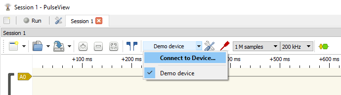

---

V seznamu zařízení vyberte `Embedded logic analyzer (ela)`:

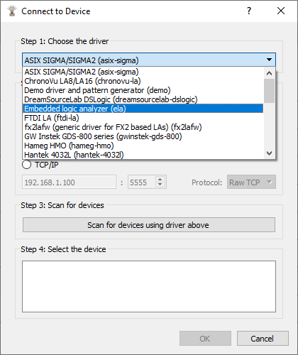

---

Následně zaškrtněte políčko `Serial Port` a zde najděte COM port které odpovídá Nucleu. Pokud nevíte číslo COM portu, můžete ho najít v:
`Ovládací panely`->`Správce zařízení`->`Porty (COM a LPT)`

V políčku baudrate nastavte `115200`. Následně klikněte na `Scan for devices using driver above` a v dolním seznamu by se mělo objevit zařízení `ELA_F303RE`. Vyberte zařízení a klikněte na `OK`.

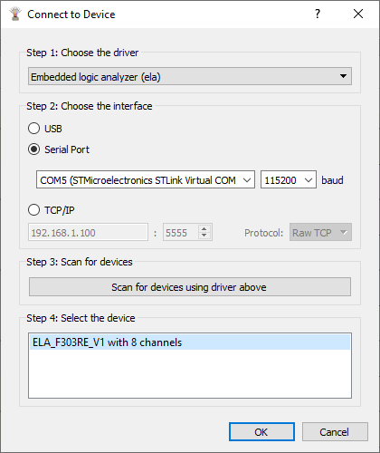

### Horní lišta

V `Nastavení parametrů vzorkování` lze nastavit poměr počtu vzorků před a po trigger.

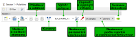

### Nastavení vstupů

Kliknutím na vstupy v PulseView se zobrazí nastavení jako je název vstupu a nastavení trigger. Stejným způsobem se nastavují také dekodéry digitálních komunikací.

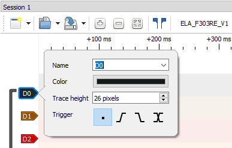

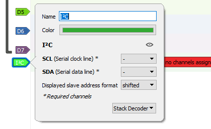

##  Ukázka použití

Zde bude ukázáno konkrétní použití ELA pro změření a dekódování dat odesílaných pomocí I2C mezi mikrořadičem Atmega328p a obvodem reálného času (RTC) DS3231M.
Mikrořadič získá data z RTC modulu pomocí I2C a následně pošle zprávu o datech pomocí UART.

### Schéma zapojení

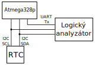

### Nastavení PulseView

V PulseView byli vypnuty všechny nepoužité vstupy logického analyzátoru a zapnuté byli pojmenovány podle toho k čemu jsou připojeny. 

Běžná komunikace I2C má frekvenci hodinového signálu 100kHz. Vzorkovací frekvenci tedy nastavíme na více než dvojnásobek, aby se neprojevil aliasing, v příkladě bylo použito 500kHz.

Počet vzorků byl ponechán na výchozích 5k. V případě že se nezaznamená celá komunikace by byl zvýšen.

Komunikace mezi mikrořadičem a RTC probíhá každé 2 vteřiny. Pokud by se tedy vzorkování spustilo okamžitě, byl by s největší pravděpodobností zaznamenán neměnící se signál. Byl proto nastaven trigger na doběžnou hranu na kanálu SDA.

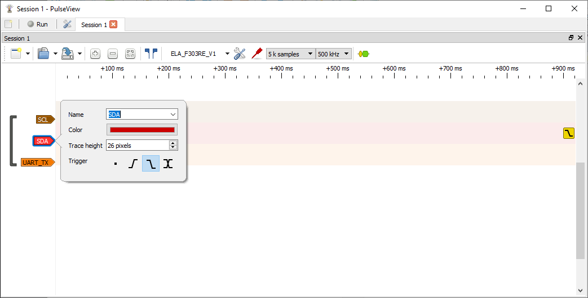

---

Po spuštění vzorkování pomocí `Run` se objeví v PulseView zaznamenaná komunikace.

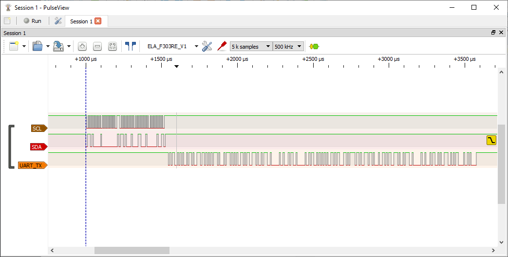

### Dékódování I2C a UART

V seznamu dekodérů v PulseView byla vybrána komunikace I2C a UART. Vzhledem k tomu že byli vstupní kanály pojmenovány podle komunikace, dekodéry si automaticky nastavili vstupy. Popřípadě lze v nastavení dekodéru zvolit vstupní kanály, které mají být použity. 

Oba dekodéry zobrazí přesně data, která jsou odesílána. V případě UART byl dekodér přepnut, aby zobrazoval ASCII znaky místo hexidecimálních hodnot. UART také musí mít nastavený správný Baud Rate, ten lze odvodit pomocí kurzorů nebo experimentálně.

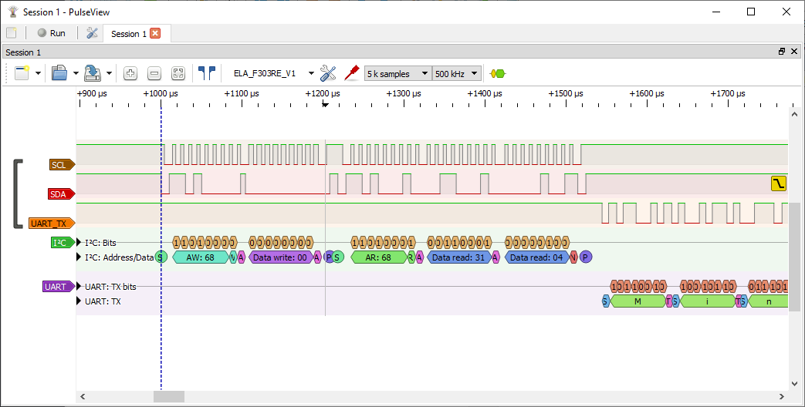

---

V PulseView je také možnost zobrazit všechna data která byla dekódována. V levém horním rohu byl vybrán `Binary Decoder Output View`. V PulseView se pak objeví nové okno, ve kterém byl vybrán dekodér `UART` a `TX Dump`. Zde pak lze vidět všechny znaky odeslané po UARTu.

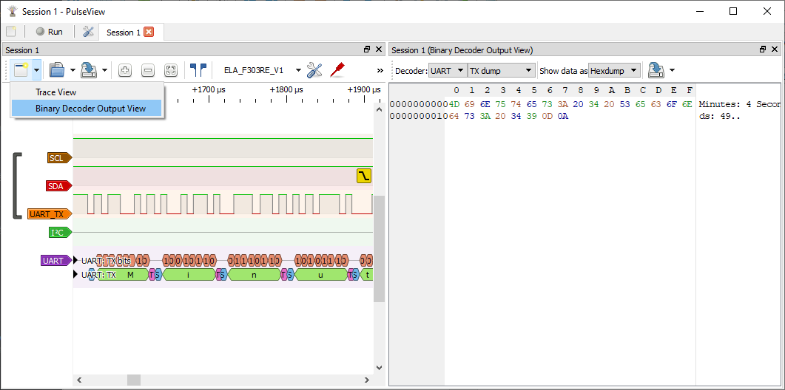
